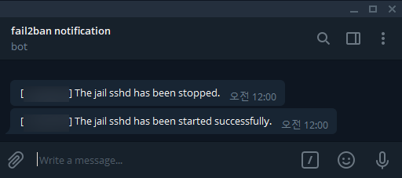

# fail2ban-telegram-action

Telegram Notification for Fail2Ban

## Installation

### Prepare a Telegram bot

1. Create a Telegram bot from the [offical guide](https://core.telegram.org/bots#6-botfather) and the get the bot **token**.
2. Start a conversation with the bot.
3. Get the `chat id` from the `getUpdates` API call.

   ```bash
   # Replace <token> with the bot token.
   $ curl -s -X POST https://api.telegram.org/bot<token>/getUpdates
   {"ok":true,"result":[{"update_id":111111111,"message":{"message_id":2,"from":{"id":22222222,"is_bot":false,"first_name":"xxxxxx","last_name":"xxxxxx","username":"xx","language_code":"ko"},"chat":{"id":22222222,"first_name":"xxxxxx","last_name":"xxxxx","username":"xxx","type":"private"},"date":1602336707,"text":"Hello, Bot!"}}]}
   ```

   You can get the `chat id` from the JSON response. `"chat":{"id":<chat_id>", ...`

### Install the action

1. Copy the `telegram.conf` to `/etc/fail2ban/action.d/telegram.conf`.
2. Set the `telegram_chat_id` and `telegram_bot_token` values to the jail. (don't surrounded by double quotes.) example: [sshd.local.example](sshd.local.example).
3. Restart the Fail2ban.

   ```bash
   sudo systemctl restart fail2ban
   ```

## Demo



